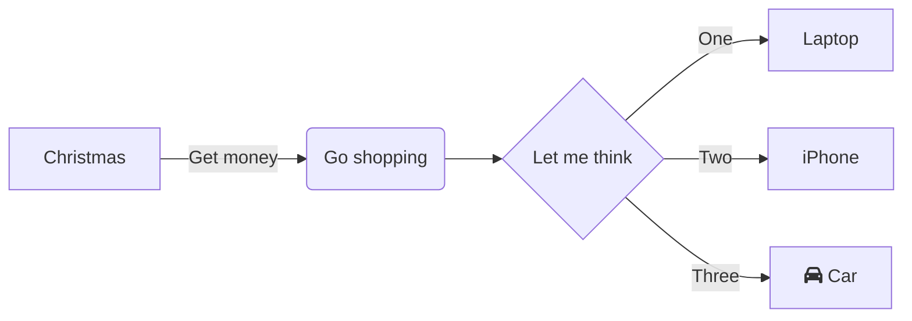

# Documentation
Extra information on your package here. 

## Sources
| Syntax              | Source                                                   |
| ------------------- | -------------------------------------------------------- |
| Basic markdown      | [link](https://www.markdownguide.org/basic-syntax/#code) |
| Advanced markdown   | [link](https://www.markdownguide.org/extended-syntax/)   |
| Mermaid docs        | [link](https://mermaid-js.github.io/mermaid/)            | 
| Mermaid live editor | [link](https://mermaid.live/edit)                        |

## Markup examples
`.md` files are created using a markup language called markdown. 

    
## Mermaid
With Mermaid you can crate markup chart. The following charts are available:
 - Flow Chart
 - Sequence Diagram
 - Class Diagram (UML)
 - State Diagram
 - Gantt Chart
 - Pie Chart
 - Entity Relationship Diagram (SQL)
 - User Journey Diagram  

Check out the documentation [here](https://mermaid-js.github.io/mermaid/) and click [here](https://mermaid.live/edit) for a live editor  

Example of a Flow chart:
